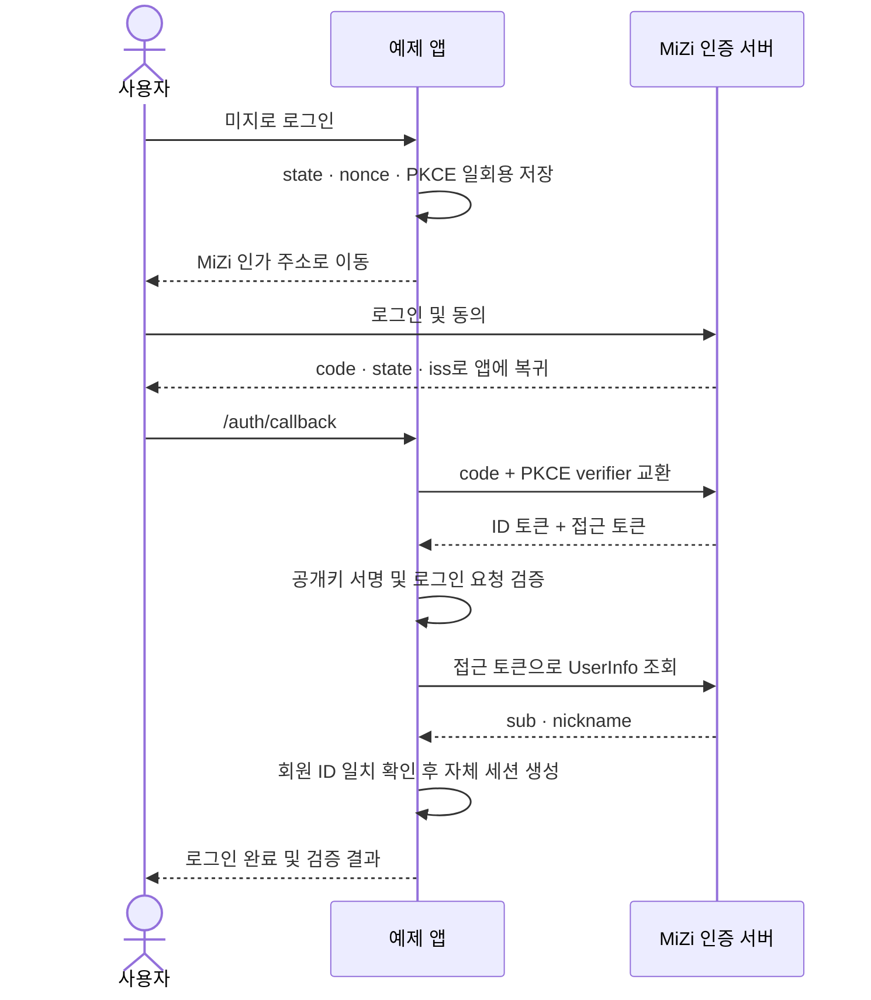

# MiZi OIDC Example

별도 웹앱에서 **미지로 로그인 → 동의한 미지 API 조회 → 내 서비스 제공**을 체험하는 예제입니다. 검증한 회원 정보로 자체 세션을 만들고, 선택적으로 회원 API를 연결해 나만의 프로젝트 시작 보드를 저장합니다.

**[라이브 데모](https://oidc-demo.cccv.to)** · **[개발자 API 가이드](https://oidc-demo.cccv.to/developers)** · **[MiZi OIDC 가이드](https://mcp-auth.cccv.ai/developer/guide/oidc)** · **[공개 Discovery](https://mcp-auth-api.cccv.ai/.well-known/openid-configuration)**

TypeScript · Hono · openid-client · jose · Node.js. 로컬에서는 메모리, AWS에서는 DynamoDB로 일회용 로그인 시도와 로그인 세션을 저장합니다.

[빠른 시작](#quickstart) · [로그인 유지 정책](#로그인-유지-정책) · [세션과 데이터](#세션과-데이터)

## 라이브에서 확인할 것

1. 데모의 **미지로 로그인**을 누릅니다.
2. 미지 계정으로 로그인하고 회원 식별·닉네임 제공에 동의합니다. 이미 유효한 미지 로그인 세션이 있으면 다시 로그인하지 않을 수 있습니다.
3. 데모로 돌아오면 **로그인 완료**와 닉네임을 확인합니다. 이 시점에 로그인은 끝났으며, 회원 ID와 ID 토큰·UserInfo 검증 결과는 펼쳐서 볼 수 있습니다.
4. **내 정보**에서 **내 미지 정보 가져오기**를 누르고 `user:profile`에 동의합니다. 데모 서버가 `GET /v1/me`와 `GET /v1/me/profile`을 호출해 닉네임·GitHub 연결 상태·소개·역할·관심 분야를 표시합니다. 회원 ID는 검증한 로그인 주체와 대조합니다. 이 단계는 선택 사항이며 건너뛰어도 로그인은 완료된 상태입니다.
5. **내 스킬**에서 스킬 읽기에 동의하면 `user:skills`로 `GET /v1/me/skills`를 조회합니다. 프로필도 함께 가져오며 스킬은 처음 20개를 보여줍니다. **더 보기**를 누르면 가져온 목록을 20개씩 펼칩니다. 제공된 출처·검증 방법·검증 주체·검증 시각과 데모 조회 시각을 구분합니다.
6. **프로젝트 보드**에서 **웹 서비스 · AI 도구 · 업무 자동화** 중 목표를 고릅니다. 준비된 시작 목록을 보고 선택을 데모 세션에 저장하는 체험이며 실제 프로젝트를 생성하지는 않습니다. 새로고침해도 선택이 유지되며, 미지에는 쓰기 요청을 보내지 않습니다.
7. 연결된 상태에서 **프로필 다시 가져오기** 또는 **스킬 다시 가져오기**를 누릅니다. 미지로 이동하지 않고 해당 화면만 새로 조회하며 프로젝트 선택은 유지됩니다. 접근 토큰 갱신이 필요하면 서버에서 처리합니다. 연결을 사용할 수 없으면 **다시 연결하기**를 선택하세요. 자동으로 미지 화면을 열지는 않습니다.
8. **이 데모에서 로그아웃**한 뒤 같은 미지 계정으로 다시 로그인해 같은 회원 ID인지 확인합니다. 최초 동의에서 거절하는 경우 데모의 로그인 세션이 만들어지지 않아야 합니다. 이미 동의한 앱은 다음 연결 때 동의 화면을 생략할 수 있습니다.

화면에 표시하는 성공 결과는 실제 코드 교환·ID 토큰 검증·UserInfo 호출이 끝난 뒤에만 생성합니다. 운영 로그인 성공은 실제 브라우저로 동의한 결과로 확인하며, 자동 테스트 결과와 구분합니다.

<a id="quickstart"></a>
## 빠른 시작

Node.js **24 LTS**와 pnpm 9.4.0을 권장합니다. Node.js 20.20 이상도 실행할 수 있습니다.

```bash
git clone https://github.com/mijiworld/mizi-oidc-example.git
cd mizi-oidc-example
corepack enable
pnpm install --frozen-lockfile
cp .env.example .env
```

1. [MiZi 개발자 센터 → OAuth 클라이언트](https://mcp-auth.cccv.ai/developer/oauth-clients)에서 공개 클라이언트를 만듭니다.
2. 돌아올 주소를 **`http://localhost:3000/auth/callback`**으로 등록합니다. 포트·경로까지 정확히 일치해야 합니다.
3. 발급받은 `mzp_…` 값을 `.env`의 `CLIENT_ID`에 넣습니다.
4. `pnpm dev`를 실행하고 [localhost:3000](http://localhost:3000)을 엽니다.

3000번 포트가 사용 중이면 `PORT`, `BASE_URL`, 등록한 콜백 URL의 포트를 함께 바꾸세요.

이 예제는 **public client + PKCE**이므로 client secret이 필요 없습니다. 첫 로그인은 `openid profile`만 요청합니다. 내 정보 가져오기는 `user:profile`, 스킬 가져오기는 `user:skills`도 추가로 요청합니다. 등록형 클라이언트는 `openid profile user:profile user:skills`를 사용할 수 있도록 설정하세요. `/v1/me/profile` 응답에는 연락처·지역도 포함되지만 데모 서버는 이를 즉시 제외하고 저장하거나 표시하지 않습니다. 토큰 교환과 API 조회는 서버에서 처리하므로 브라우저 CORS 허용 출처를 추가할 필요가 없습니다.

라이브 데모는 [자체 CIMD 문서](https://oidc-demo.cccv.to/client.json)를 client ID로 사용합니다. CIMD는 앱을 확인하는 방식이고, 이 예제의 로그인 흐름은 OIDC입니다. 로컬 `localhost`의 CIMD 문서는 미지 서버가 조회할 수 없으므로 위의 사전 등록한 공개 클라이언트를 사용합니다.

## 로그인 흐름



검증은 `openid-client`의 프로토콜 처리와 `jose`의 명시적 RS256 서명 검증을 함께 사용합니다. 발급자(`iss`), 대상 앱(`aud`), 유효기간, `nonce`, 접근 토큰 해시(`at_hash`), 콜백의 `state`·`iss`, UserInfo의 `sub`를 확인합니다. 라이브러리의 검증을 통과하기 전에 앱 로그인 세션을 만들지 않습니다.

## 로그인 유지 정책

새 로그인은 **30일 미사용 시 만료, 실제 미지 인증 후 최대 90일**을 적용합니다. 로그인한 홈·내 정보·내 스킬·프로젝트 방문과 해당 화면의 정상 POST는 미사용 기한을 갱신합니다. ‘더 보기’나 프로젝트 선택도 사용으로 보지만, 브라우저를 열어 두기만 하는 백그라운드 ping은 없습니다. 계속 사용해도 90일 상한은 연장되지 않습니다.

미지의 로그인, 이 데모의 로그인, Google 등의 로그인은 서로 다른 세션입니다. 미지도 30일 미사용·90일 절대 한도를 적용하지만, 한 서비스의 로그아웃이 나머지 세션까지 끝내지는 않습니다. 브라우저를 다시 열어도 유효한 영속 쿠키가 있으면 로그인은 유지됩니다. 쿠키 삭제나 로그아웃, 세션 만료 시에는 다시 로그인합니다.

| 대상 | 현재 수명과 역할 |
| --- | --- |
| 데모 로그인 | 마지막 사용부터 30일, 세션 발급·검증한 `auth_time`부터 각각 90일 중 이른 상한 |
| 로그인 시도 (`state`·`nonce`·PKCE) | 10분, 브라우저에 묶인 일회용 요청 |
| 인가 코드 | 60초, 일회용 교환 |
| ID 토큰 | 5분, 로그인 검증용; 앱 세션 수명과 별개 |
| 접근 토큰 | 현재 1시간; 실제 응답의 `expires_in`으로 만료 계산 |
| 미지 refresh token | 90일 미사용 또는 발급 후 365일; 데모 로그인 한도를 늘리지 않음 |

이 정책 전의 데모 세션은 기존 30분 만료를 유지하며 새 로그인부터 새 정책을 적용합니다. refresh token이 없는 예전 API 연결은 한 번 다시 연결해야 합니다. OIDC가 30일·90일 수명을 정하는 것은 아닙니다.

개발자가 정책을 바꾸려면 [`src/session-policy.ts`](src/session-policy.ts)의 `SESSION_IDLE_SECONDS`와 `SESSION_ABSOLUTE_SECONDS`를 함께 검토하세요. 서버 만료 검사·쿠키 수명·DynamoDB TTL·OIDC `max_age`가 같은 정책을 따라야 합니다. `max_age`와 검증한 `auth_time`은 오래된 미지 로그인으로 90일 상한을 새로 시작하지 않게 합니다. 토큰 갱신은 별도의 로그인 증명이 아닙니다.

## 로그인 다음에 API와 서비스를 연결하기

체험 화면은 `/`(내 홈), `/profile`(내 정보), `/skills`(내 스킬), `/projects`(프로젝트 보드)로 나뉩니다. 내 정보·내 스킬·프로젝트는 로그인해야 열립니다. 기존 세션도 사용할 수 있고, 새 소개·스킬 정보는 사용자가 가져오기 버튼으로 조회할 때 추가됩니다.

`/developers`의 **개발자 API 가이드**는 로그인 없이 읽을 수 있습니다. 필요한 권한, 요청·응답 예제, 페이지 조회, 오류 처리와 실제 구현 파일을 한곳에 모았습니다. 페이지의 응답은 설명용 가상 예제이며 회원 세션이나 실제 API를 조회하지 않습니다. 데모 상단의 **API 가이드**에서 열 수 있습니다.

- **로그인 증명:** ID 토큰으로 미지 회원임을 확인합니다.
- **추가 API 권한:** 처음 연결할 때 프로필 버튼은 `user:profile`, 스킬 버튼은 `user:profile user:skills`를 요청합니다. 기존 스킬 조회 기록이 있으면 명시적 재연결 때도 해당 권한을 요청합니다. API에는 접근 토큰을 사용하며 ID 토큰을 보내지 않습니다.
- **연결 후 재조회:** `POST /refresh-profile`은 `/v1/me`와 `/v1/me/profile`만, `POST /refresh-skills`는 `/v1/me/skills`만 새로 읽습니다. 접근 토큰이 만료에 가까우면 서버에서 먼저 갱신합니다. 다른 화면의 결과·프로젝트 선택·세션 ID와 로그인 절대 한도는 유지합니다. 최초 연결·권한 추가·연결 취소 등에는 별도 `POST /connect-profile`, `POST /connect-skills`를 사용자가 직접 선택합니다.
- **실제 읽기:** 인가 요청과 코드 교환 모두 호출할 고정 주소(`/v1/me`, `/v1/me/profile`, 필요한 경우 `/v1/me/skills`)를 반복 `resource`로 전달합니다. 서버는 UserInfo 대상도 함께 넣습니다. 현재 회원 API는 scope와 토큰 유효성·연결 취소를 검사하며, audience 자체를 검사한다고 설명하지 않습니다.
- **응답 검증:** `/v1/me`의 `id`, `/v1/me/profile`의 `user.id`를 검증한 `sub`와 대조합니다. Zod로 응답을 검사하고 필요한 필드만 보관합니다. 스킬 응답에는 소유자 ID가 없어 검증된 접근 토큰으로 조회한 세션 주체에 묶습니다. GitHub 상태나 검증 시각을 알 수 없을 때는 정보 없음으로 표시합니다.
- **자체 서비스:** 프로젝트 목표와 시작 목록은 데모의 고정 예시입니다. 선택은 `/service/goal`을 통해 데모 세션에만 기록하며 미지의 추천이나 검증한 역량을 의미하지 않습니다.

API 응답은 **조회 당시의 요약**입니다. 다시 가져오기는 서버 전용으로 보관한 접근 토큰을 사용합니다. 통신 실패·잘못된 응답에는 이전 결과와 조회 시각을 유지하고, 프로필 일부만 성공하면 성공한 결과만 갱신합니다. 갱신이 `invalid_grant`로 거절되거나 API가 401/403으로 접근을 거절하면 연결 자격을 제거하고 명시적 재연결을 안내합니다. 데모 로그인은 별도로 유지됩니다. 보드에는 기본 회원 API(`/v1/me`) 성공이 필요하며, 소개나 스킬 조회 실패가 기본 회원 API의 성공을 지우지는 않습니다. 회원 ID 불일치는 인증 경계 오류로 처리하고 다른 회원 정보를 저장하지 않습니다.

소개·역할·관심 분야는 회원이 작성한 내용입니다. 스킬은 미지 API가 제공한 출처와 검증 정보를 보여주며 이 데모가 독립적으로 검증하지 않습니다. 비공개 스킬도 포함될 수 있어 로그인한 본인 세션 안에서만 표시합니다. CCCV 보충 조회 실패가 목록 API에서 별도 표시되지 않을 수 있으므로 빈 응답이나 커서 소진을 전체 스킬 조회 완료로 단정하지 않습니다. 스킬 분석 시작·정보 수정·온체인 조회는 수행하지 않습니다.

스킬 조회는 콜백과 재조회에서 API의 다음 커서를 따라가며 최대 **200개·세션에 저장할 요약 192 KiB·10페이지·5초** 안에서 목록을 모읍니다. 응답 본문은 페이지당 256 KiB, 누적 1 MiB로 제한하며, 최초 연결에서는 콜백 처리 시작 후 12초까지의 공통 API 시간 제한도 적용합니다. 재조회는 토큰 만료 시각과 5초 중 이른 제한을 적용합니다. 먼저 도달한 제한에서 멈추고, 첫 성공 페이지 뒤에 오류가 나면 이미 읽은 목록과 중단 이유를 남깁니다. 단, 재조회 중 어느 페이지든 401/403이 발생하면 이번 목록을 저장하지 않고 이전 목록·조회 시각을 유지하며 접근·갱신 토큰을 제거하고 재연결을 안내합니다. 같은 ID는 처음 받은 값을 유지합니다. `collection`에는 조회 페이지 수·시작 시각·중단 이유·중복 수를 보관하며 커서는 남기지 않습니다. 스킬 요약에는 토큰을 넣지 않습니다. `truncated`는 수집 제한이나 중단을, `hasMore`는 마지막 성공한 API 응답의 다음 커서 유무를 뜻합니다. 화면에서 아직 펼치지 않은 개수와는 별개입니다.

**더 보기**는 `/skills?shown=40#skill-21` 같은 데모 내부 GET으로 저장된 목록만 펼칩니다. 추가 API 호출·동의·세션 교체가 없고 프로젝트 선택을 유지합니다. 정상 페이지 방문이므로 미사용 기한은 갱신하지만 로그인 절대 한도는 바꾸지 않습니다. 예전 세션에 갱신 가능한 연결이 없다면 한 번 **다시 연결하기**를 사용합니다.

목표는 유효한 데모 세션에만 저장됩니다. 명시적 재연결로 같은 issuer·회원임을 확인하고 새 기본 회원 조회까지 성공하면 유효한 기존 세션의 목표를 새 세션에 이어갑니다. 만료된 세션의 목표를 되살리거나 다른 계정에 넘기지 않습니다. 로그아웃하면 목표도 삭제됩니다. 미지에서 연결을 해제해도 이미 저장된 요약과 데모 세션이 즉시 사라지는 것은 아니므로, 즉시 지우려면 데모에서도 로그아웃하세요.

## 코드 찾기

- [`src/`](src): 설정, 로그인 라우트, OIDC 검증, 세션 저장, 화면을 역할별로 분리한 구현
- [`src/member-api.ts`](src/member-api.ts): Bearer 토큰을 사용하는 실제 회원 API 조회와 최소 응답 추출
- [`src/extra-api.ts`](src/extra-api.ts): 소개·관심 분야와 스킬 API의 최소 정보 조회
- [`src/api-grant.ts`](src/api-grant.ts): 서버 전용 접근 토큰의 회원·범위·대상·만료 스키마
- [`src/api-refresh.ts`](src/api-refresh.ts): 기존 연결을 사용하는 고정 API 재조회와 시간 제한
- [`src/developer-guide.ts`](src/developer-guide.ts): 로그인 없이 읽는 개발자 API 가이드와 가상 응답 예제
- [`src/service.ts`](src/service.ts): 미지 데이터와 구분되는 데모 자체의 목표·시작 계획
- [`test/`](test): 정상 로그인과 잘못된 콜백·토큰·재사용을 검증하는 테스트
- [`infra/template.yml`](infra/template.yml): Lambda + HTTP API + DynamoDB + HTTPS 도메인
- [`infra/README.md`](infra/README.md): AWS 배포·확인·삭제 절차

```bash
pnpm typecheck
pnpm test
pnpm build
pnpm start
```

## 세션과 데이터

- 로그인 시도는 10분 뒤 만료됩니다. 로그인 세션의 미사용·절대 한도는 위 정책을 따르며 DynamoDB의 지연된 TTL 삭제와 별개로 앱이 만료를 검사합니다.
- 브라우저에는 무작위 세션 식별자만 든 영속 쿠키를 둡니다. 운영 쿠키는 `__Host-` 접두사, `Secure`, `HttpOnly`, `SameSite=Lax`를 사용하고 정상 방문 때 남은 기한을 갱신합니다.
- 추가 API 동의로 받은 **접근·갱신 토큰은 서버 전용 필드**에만 보관합니다. 운영 DynamoDB는 저장 시 암호화(SSE)를 사용합니다. 일반 세션 조회·화면 모델·브라우저·로그·GitHub에 원문을 전달하지 않으며 ID 토큰은 보관하지 않습니다. 화면에는 회원 식별·검증 결과, API 최소 요약과 프로젝트 목표만 전달합니다.
- 접근 토큰의 실제 `expires_in`을 검사하고, 명시적인 API 다시 가져오기 요청에서 필요할 때만 서버가 refresh token을 사용합니다. 갱신은 분산 잠금과 조건부 저장으로 직렬화하고 회전된 최신 토큰을 함께 보관합니다. 갱신으로 로그인 절대 한도를 연장하지 않습니다. 통신 실패는 기존 정보와 시각을 유지하며, 권한 취소나 `invalid_grant`에는 재연결을 안내합니다.
- 로그아웃·계정 교체 시 이전 서버 세션과 접근·갱신 토큰을 삭제합니다. DynamoDB TTL의 물리 삭제는 지연될 수 있지만, 앱은 만료된 세션·자격을 사용하지 않습니다.
- **데모 로그아웃은 이 앱의 세션만 끝냅니다.** 미지 자체의 로그인 상태나 다른 앱 연결을 해제하지 않습니다. 미지에 허용한 연결은 미지 설정에서 별도로 관리할 수 있습니다.
- ID 토큰의 수명과 예제 앱의 로그인 세션 수명은 별개입니다. 이 예제는 SSO 전역 로그아웃·계정 삭제를 구현하지 않습니다.

로그인한 각 페이지와 홈 문서의 `Referrer-Policy` 헤더와 HTML meta는 `strict-origin`을 사용합니다. `no-referrer`는 브라우저의 폼 POST에서 `Origin: null`을 만들 수 있어, 정상 로그인·로그아웃도 엄격한 Origin 검사에 막히기 때문입니다([Fetch 표준](https://fetch.spec.whatwg.org/#append-a-request-origin-header)). 페이지의 경로·쿼리는 Referer로 전달하지 않으며, 로그인·로그아웃 리다이렉트와 콜백·HTTP 오류 응답은 `no-referrer`를 유지합니다. POST는 여전히 설정한 `BASE_URL`과 정확히 일치하는 Origin만 허용합니다.

## 연동 범위

이 저장소는 Authorization Code + PKCE(S256) OIDC 연동을 보여주는 참고 구현입니다. OIDC 전체 옵션 지원이나 미지 인증 서버의 OpenID 인증 획득을 의미하지 않습니다. 라이브 데모에서 쓰는 미지 계정은 실제 계정입니다.

보안 결함을 제보할 때는 토큰·쿠키·인가 코드나 개인 회원 정보를 공개 이슈에 붙이지 마세요. 대신 재현 단계와 비밀을 제거한 오류 정보를 제공하세요.

## 표준과 라이브러리

- [OpenID Connect Core](https://openid.net/specs/openid-connect-core-1_0.html)
- [PKCE — RFC 7636](https://www.rfc-editor.org/rfc/rfc7636)
- [openid-client](https://github.com/panva/openid-client)
- [jose](https://github.com/panva/jose)

MIT 라이선스. 코드를 복사하거나 수정해 여러분의 서비스에 사용할 수 있습니다.
