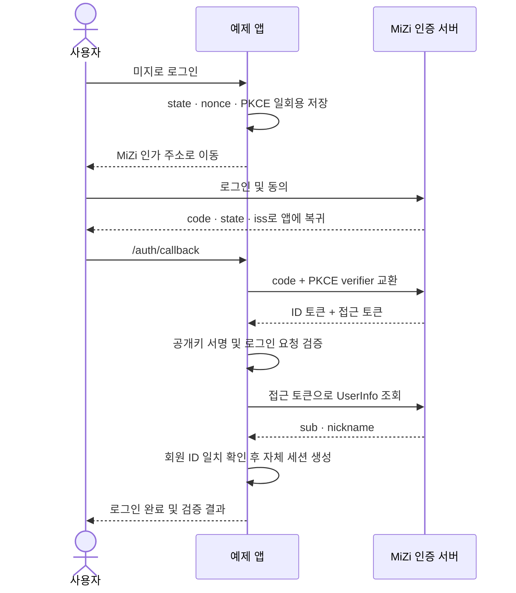

# MiZi OIDC Example

별도 웹앱에서 **미지로 로그인**하고, 검증한 회원 정보로 자체 로그인 세션을 만드는 예제입니다.

**[라이브 데모](https://oidc-demo.cccv.to)** · **[MiZi OIDC 가이드](https://mcp-auth.cccv.ai/developer/guide/oidc)** · **[공개 Discovery](https://mcp-auth-api.cccv.ai/.well-known/openid-configuration)**

TypeScript · Hono · openid-client · jose · Node.js. 로컬에서는 메모리, AWS에서는 DynamoDB로 일회용 로그인 시도와 로그인 세션을 저장합니다.

## 라이브에서 확인할 것

1. 데모의 **미지로 로그인**을 누릅니다.
2. 미지 계정으로 로그인하고 회원 식별·닉네임 제공에 동의합니다. 이미 유효한 미지 로그인 세션이 있으면 다시 로그인하지 않을 수 있습니다.
3. 데모로 돌아오면 닉네임, 회원 ID, ID 토큰 검증 결과, 회원 조회 결과의 일치를 확인합니다.
4. **이 데모에서 로그아웃**한 뒤 같은 미지 계정으로 다시 로그인해 같은 회원 ID인지 확인합니다. 최초 동의에서 거절하는 경우 데모의 로그인 세션이 만들어지지 않아야 합니다. 이미 동의한 앱은 다음 연결 때 동의 화면을 생략할 수 있습니다.

화면에 표시하는 성공 결과는 실제 코드 교환·ID 토큰 검증·UserInfo 호출이 끝난 뒤에만 생성합니다. 운영 로그인 성공은 실제 브라우저로 동의한 결과로 확인하며, 자동 테스트 결과와 구분합니다.

<a id="quickstart"></a>
## 빠른 시작

Node.js **24 LTS**와 pnpm 9.4.0을 권장합니다. Node.js 20.20 이상도 실행할 수 있습니다.

```bash
git clone https://github.com/mijiworld/mizi-oidc-example.git
cd mizi-oidc-example
corepack enable
pnpm install --frozen-lockfile
cp .env.example .env
```

1. [MiZi 개발자 센터 → OAuth 클라이언트](https://mcp-auth.cccv.ai/developer/oauth-clients)에서 공개 클라이언트를 만듭니다.
2. 돌아올 주소를 **`http://localhost:3000/auth/callback`**으로 등록합니다. 포트·경로까지 정확히 일치해야 합니다.
3. 발급받은 `mzp_…` 값을 `.env`의 `CLIENT_ID`에 넣습니다.
4. `pnpm dev`를 실행하고 [localhost:3000](http://localhost:3000)을 엽니다.

3000번 포트가 사용 중이면 `PORT`, `BASE_URL`, 등록한 콜백 URL의 포트를 함께 바꾸세요.

이 예제는 **public client + PKCE**이므로 client secret이 필요 없습니다. `openid profile`만 요청하며 이메일·연락처·다른 미지 API 데이터는 요청하지 않습니다. 토큰 교환과 회원 조회는 예제 서버에서 처리하므로 브라우저 CORS 허용 출처를 추가할 필요가 없습니다.

라이브 데모는 [자체 CIMD 문서](https://oidc-demo.cccv.to/client.json)를 client ID로 사용합니다. CIMD는 앱을 확인하는 방식이고, 이 예제의 로그인 흐름은 OIDC입니다. 로컬 `localhost`의 CIMD 문서는 미지 서버가 조회할 수 없으므로 위의 사전 등록한 공개 클라이언트를 사용합니다.

## 로그인 흐름



검증은 `openid-client`의 프로토콜 처리와 `jose`의 명시적 RS256 서명 검증을 함께 사용합니다. 발급자(`iss`), 대상 앱(`aud`), 유효기간, `nonce`, 접근 토큰 해시(`at_hash`), 콜백의 `state`·`iss`, UserInfo의 `sub`를 확인합니다. 라이브러리의 검증을 통과하기 전에 앱 로그인 세션을 만들지 않습니다.

## 코드 찾기

- [`src/`](src): 설정, 로그인 라우트, OIDC 검증, 세션 저장, 화면을 역할별로 분리한 구현
- [`test/`](test): 정상 로그인과 잘못된 콜백·토큰·재사용을 검증하는 테스트
- [`infra/template.yml`](infra/template.yml): Lambda + HTTP API + DynamoDB + HTTPS 도메인
- [`infra/README.md`](infra/README.md): AWS 배포·확인·삭제 절차

```bash
pnpm typecheck
pnpm test
pnpm build
pnpm start
```

## 세션과 데이터

- 로그인 시도는 10분 뒤, 데모 로그인 세션은 30분 뒤 만료됩니다. DynamoDB의 지연된 TTL 삭제와 별개로 앱에서 매 요청마다 만료를 검사합니다.
- 브라우저 쿠키에는 무작위 세션 식별자만 저장합니다. 운영 쿠키는 `__Host-` 접두사, `Secure`, `HttpOnly`, `SameSite=Lax`를 사용합니다.
- 접근·갱신·ID 토큰 원문은 검증 후 보관하지 않으며 화면·로그·GitHub에 기록하지 않습니다. 데모 세션에는 회원 ID·닉네임과 검증 결과만 남깁니다.
- **데모 로그아웃은 이 앱의 세션만 끝냅니다.** 미지 자체의 로그인 상태나 다른 앱 연결을 해제하지 않습니다. 미지에 허용한 연결은 미지 설정에서 별도로 관리할 수 있습니다.
- ID 토큰의 수명과 예제 앱의 로그인 세션 수명은 별개입니다. 이 예제는 토큰 갱신·SSO 전역 로그아웃·계정 삭제를 구현하지 않습니다.

홈 문서의 `Referrer-Policy` 헤더와 HTML meta는 `strict-origin`을 사용합니다. `no-referrer`는 브라우저의 폼 POST에서 `Origin: null`을 만들 수 있어, 정상 로그인·로그아웃도 엄격한 Origin 검사에 막히기 때문입니다([Fetch 표준](https://fetch.spec.whatwg.org/#append-a-request-origin-header)). 홈에서 경로·쿼리는 Referer로 전달하지 않으며, 로그인·로그아웃 리다이렉트와 콜백·HTTP 오류 응답은 `no-referrer`를 유지합니다. POST는 여전히 설정한 `BASE_URL`과 정확히 일치하는 Origin만 허용합니다.

## 연동 범위

이 저장소는 Authorization Code + PKCE(S256) OIDC 연동을 보여주는 참고 구현입니다. OIDC 전체 옵션 지원이나 미지 인증 서버의 OpenID 인증 획득을 의미하지 않습니다. 라이브 데모에서 쓰는 미지 계정은 실제 계정입니다.

보안 결함을 제보할 때는 토큰·쿠키·인가 코드나 개인 회원 정보를 공개 이슈에 붙이지 마세요. 대신 재현 단계와 비밀을 제거한 오류 정보를 제공하세요.

## 표준과 라이브러리

- [OpenID Connect Core](https://openid.net/specs/openid-connect-core-1_0.html)
- [PKCE — RFC 7636](https://www.rfc-editor.org/rfc/rfc7636)
- [openid-client](https://github.com/panva/openid-client)
- [jose](https://github.com/panva/jose)

MIT 라이선스. 코드를 복사하거나 수정해 여러분의 서비스에 사용할 수 있습니다.
